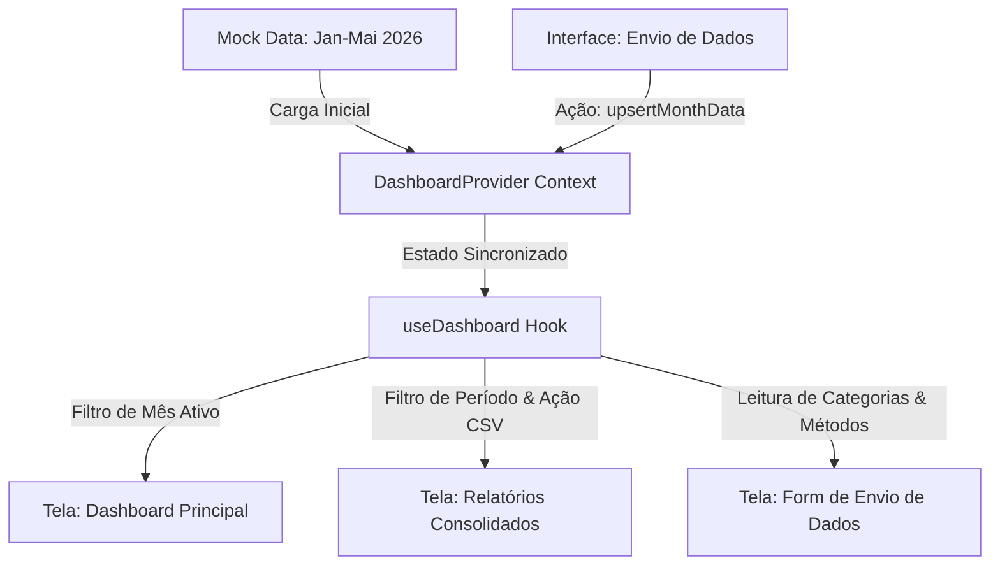

# Arquitetura e Fluxo de Dados - Dashboard Comercial e de Captação

Este documento detalha o funcionamento lógico da aplicação de Dashboard, Relatórios e Envio de Dados, cobrindo o mapeamento de entidades, o fluxo de estado global em tempo real e as diretrizes de preparação para a integração com futuras APIs.

---

## 1. Visão Geral da Arquitetura de Dados

O sistema opera com um fluxo de dados unidirecional baseado em um **Provedor de Estado Global (React Context)**. Esse fluxo centraliza os dados provenientes de fontes simuladas (Mocks) e aceita inserções dinâmicas pela interface de "Envio de Dados", calculando KPIs em tempo real e retransmitindo de forma reativa para os componentes do Dashboard e de Relatórios.



---

## 2. Estrutura e Mapeamento de Entidades (TypeScript)

Os dados estão estruturados em três grandes domínios lógicos, localizados no diretório [src/types/](file:///c:/Users/Public/APPs/00-Rascunhos/Dashboard/01.2-App-Dashboard/src/types/):

### A. Dashboard e Captação ([dashboard.ts](file:///c:/Users/Public/APPs/00-Rascunhos/Dashboard/01.2-App-Dashboard/src/types/dashboard.ts))
Representa os KPIs operacionais mensais e sua quebra em origens de tráfego, canais e campanhas de marketing.
- **`MonthlySummary`**: Agrega os KPIs consolidados (Beneficiários ativos, novos, cancelados, leads, conversões, CAC, LTV, receita, churn rate, growth rate).
- **`TrafficSource`**: Mapeia o desempenho e investimento direcionado por origem (Google Ads, Meta Ads, etc.).
- **`AcquisitionChannel`**: Segmenta o volume de atração por canal organizacional (Digital, Venda Direta, Parceiros).
- **`CityDistribution`**: Permite análise geográfica do crescimento da base.
- **`CampaignPerformance`**: Detalha o desempenho de tráfego pago individualizado por campanha (Impressões, Clicks, CTR, CPL, CAC).

### B. Investimentos e Custos ([investments.ts](file:///c:/Users/Public/APPs/00-Rascunhos/Dashboard/01.2-App-Dashboard/src/types/investments.ts))
Controla todos os investimentos despendidos na atração de clientes divididos em categorias parametrizáveis:
- **`InvestmentCategory`**: Define a natureza e tipo do gasto (`marketing`, `sales` ou `operational`).
- **`MonthlyInvestmentDetail`**: Detalha os valores gastos por categoria em um mês específico, calculando somatórios de forma automatizada.

### C. Relatórios Consolidados ([reports.ts](file:///c:/Users/Public/APPs/00-Rascunhos/Dashboard/01.2-App-Dashboard/src/types/reports.ts))
Define os formatos de exportação e consolidação por períodos:
- **`ConsolidatedReportRow`**: Linha formatada contendo a união de métricas do dashboard e investimentos.
- **`ConsolidatedReportTotals`**: Agrupadores aritméticos de soma e média dos indicadores para exibição no rodapé dos relatórios.

---

## 3. Estado Global e Lógica de Negócio Reativa

A lógica de dados reside em [src/context/DashboardContext.tsx](file:///c:/Users/Public/APPs/00-Rascunhos/Dashboard/01.2-App-Dashboard/src/context/DashboardContext.tsx), sob a gerência do hook [src/hooks/useDashboard.ts](file:///c:/Users/Public/APPs/00-Rascunhos/Dashboard/01.2-App-Dashboard/src/hooks/useDashboard.ts). 

### Mecanismos de Filtro e Alimentação
1. **Filtro Mensal Simples (Dashboard)**: O estado `selectedMonth` atua como chave seletora no mapa de meses (`MonthDataMap`). Quando o usuário altera o mês no menu suspenso, `currentMonthData` é atualizado imediatamente via `useMemo`.
2. **Filtro de Período (Relatórios)**: O estado `reportFilter` controla os limites (`startMonth` e `endMonth`). O relatório completo (`consolidatedReport`) é recalculado dinamicamente mesclando as informações operacionais com a carteira de investimentos mensal.
3. **Cálculos Matemáticos em Tempo Real**:
   - **Taxa de Conversão**: (Conversões / Leads) * 100
   - **CAC**: (Total Investido Marketing + Vendas) / Novos Beneficiários
   - **CPL**: Investimento Google ou Meta / Leads
   - **Taxa de Churn**: (Cancelados / Ativos) * 100
   - **Taxa de Crescimento**: ((Ativos - Ativos Mês Anterior) / Ativos Mês Anterior) * 100
   - **Receita Estimada**: Ativos * Ticket Médio (R$ 120,00)

---

## 4. Estratégia de Integração com APIs Futuras

Para realizar a transição do mock estático para uma API real (REST ou GraphQL) sem quebrar a interface gráfica e o fluxo de dados existente, propõe-se o seguinte roteiro técnico:

### A. Camada de Abstração de Serviços
Recomenda-se criar uma pasta `src/services/api.ts` baseada em instâncias do **Axios** ou **Fetch API**:

```typescript
// Exemplo estrutural de serviço para consumo futuro
import axios from 'axios';
import { DashboardDataPayload } from '../types/dashboard';

const api = axios.create({
  baseURL: import.meta.env.VITE_API_URL || 'https://api.dashboard.com/v1',
  headers: { 'Content-Type': 'application/json' }
});

export const dashboardService = {
  async getMonthData(month: string): Promise<DashboardDataPayload> {
    const { data } = await api.get<DashboardDataPayload>(`/dashboard/${month}`);
    return data;
  },
  
  async saveMonthData(month: string, payload: Partial<DashboardDataPayload>): Promise<void> {
    await api.post(`/dashboard/${month}`, payload);
  }
};
```

### B. Adaptação no Contexto (`DashboardContext.tsx`)
A migração consistirá em substituir os dados locais por chamadas assíncronas atreladas a estados de carregamento (`isLoading`) e erros (`error`), além de estratégias de **Caching** ou ferramentas como **React Query (TanStack Query)**:

```typescript
// Estrutura conceitual pós-migração com React Query
import { useQuery, useMutation, useQueryClient } from '@tanstack/react-query';

export const DashboardProvider = ({ children }) => {
  const queryClient = useQueryClient();
  const [selectedMonth, setSelectedMonth] = useState('2026-05');

  // Query para buscar dados do mês selecionado
  const { data: currentMonthData, isLoading, error } = useQuery({
    queryKey: ['dashboard', selectedMonth],
    queryFn: () => dashboardService.getMonthData(selectedMonth)
  });

  // Mutação para salvar dados
  const mutation = useMutation({
    mutationFn: ({ month, data }) => dashboardService.saveMonthData(month, data),
    onSuccess: () => {
      // Invalida o cache e força a atualização visual instantânea
      queryClient.invalidateQueries({ queryKey: ['dashboard'] });
    }
  });

  // ... restante do contexto fornece a mesma interface para os componentes UI
};
```

**Benefício da Abstração**: Como toda a lógica de tratamento e tipagem foi desenvolvida de forma isolada, os componentes visuais criados pelo UI Engineer (gráficos, tabelas e formulários) continuarão funcionando integralmente sem necessitar de nenhuma alteração em seus códigos durante a integração final da API.

---

## 5. Exportação e Utilidades de Relatórios

O hook `useDashboard.ts` fornece uma função utilitária nativa `exportConsolidatedReportCSV()` que gera um relatório CSV adaptado aos padrões de planilhas brasileiras (separador de campo por ponto e vírgula e substituição automática de ponto por vírgula em casas decimais), viabilizando auditorias manuais e consumo por ferramentas como Excel e Google Sheets.
