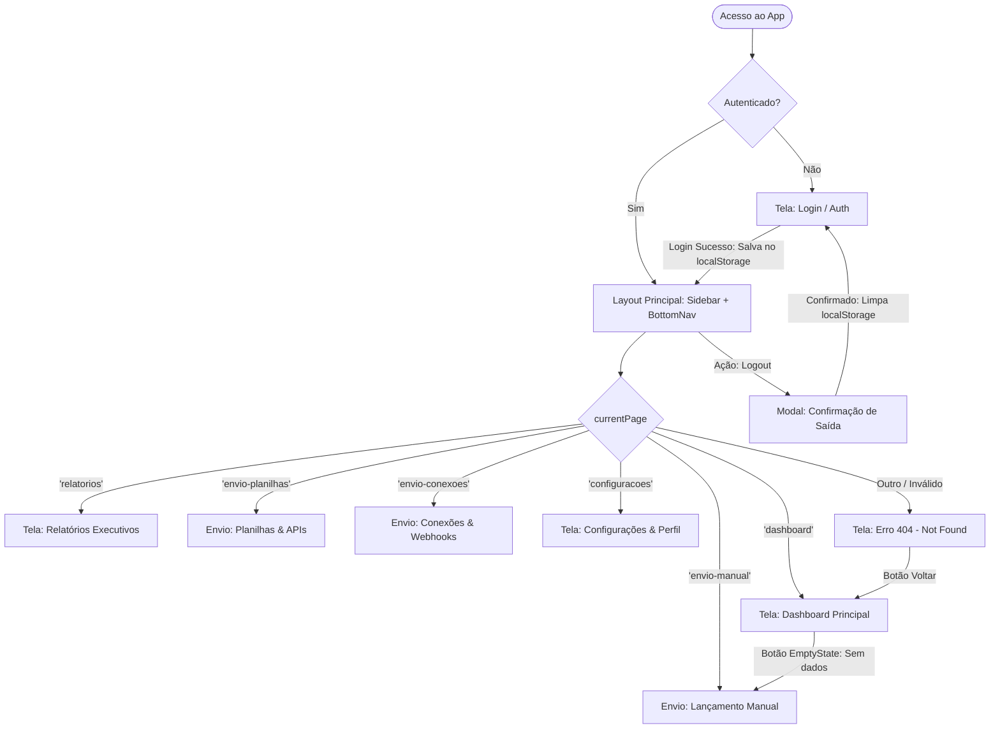
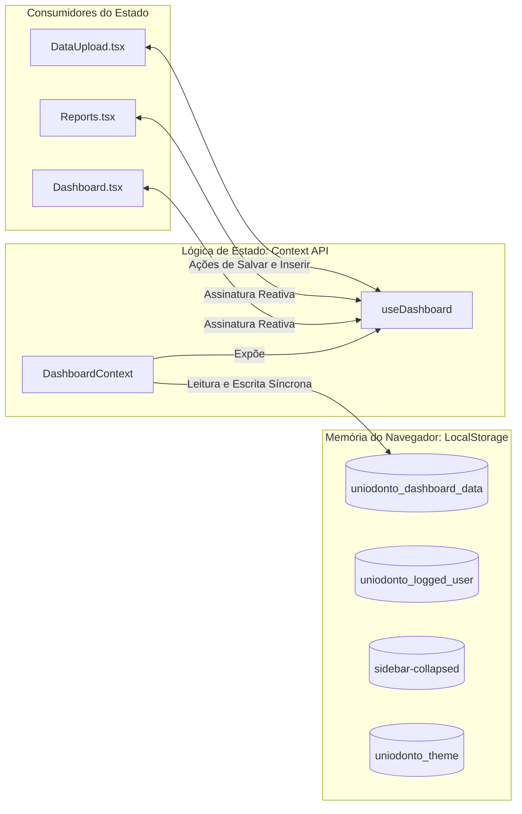

# Documentação Técnica e Arquitetural — Dashboard Uniodonto Passos

Esta é a documentação oficial e definitiva do ecossistema do **Dashboard Uniodonto Passos**. Este guia foi planejado para engenheiros de software, designers de UX/UI, analistas de negócios e auditores de sistemas, detalhando toda a engenharia do projeto, desde a estrutura física até as vias complexas de fluxo de dados, mapas de rotas e políticas de acessibilidade.

---

## 🗺️ 1. Mapa de Rotas e Telas (Navegação SPA)

O aplicativo opera no modelo **SPA (Single Page Application)**. A navegação não recarrega o navegador e é orquestrada por um estado centralizado (`currentPage`) no componente orquestrador [App.tsx](file:///c:/Users/Public/APPs/00-Rascunhos/Dashboard/01.2-App-Dashboard/src/App.tsx).

### Fluxograma de Estados de Rotas (Navegação)



### Detalhamento das Telas e "Vias" de Acesso

1. **Autenticação (`/login` simulado):**
   - **Componente:** `Login.tsx`.
   - **Função:** Validação de credenciais. Se o usuário estiver deslogado (chave `uniodonto_logged_user` vazia no `localStorage`), o app bloqueia qualquer tela e renderiza o painel de login.
2. **Dashboard Principal (`/dashboard`):**
   - **Componente:** `Dashboard.tsx`.
   - **Comportamento Responsivo:** 
     - **Desktop (md+):** Renderiza o grid corporativo clássico com cabeçalho de filtros (`Header`), KPIs em carrossel dinâmico (`KPICardGrid`), gráfico principal de anúncios (`AdPerformanceChart`), tabela vertical de investimentos (`InvestmentTable`) e abas do funil de conversão (`ConversionFunnelTabs`).
     - **Mobile (< md):** Renderiza um layout mobile premium com cabeçalho compacto (`MobileDashboardHeader`), seletor de abas superior (`MobileDashboardTabs`), faixa rápida de KPIs (`MobileKpiStrip`) e cartões dedicados autossuficientes (`MobileBeneficiariesCard`, `MobileAdsPerformanceCard`, `MobileInvestmentsPreviewCard`, `MobileFunnelCard`).
3. **Relatórios Consolidados (`/relatorios`):**
   - **Componente:** `Reports.tsx`.
   - **Função:** Central de inteligência analítica para Diretores e CEO (Modo CEO / Shark Tank). Reúne 4 insights estratégicos contextuais detalhados por tipo de relatório e exibe um grid adaptativo em 3 colunas com **3 gráficos lineares dinâmicos** (`TrendCharts.tsx`) reativos ao tema. Fornece exportação otimizada em PDF de 2 páginas via `pdfExporter.ts` (capturando os 3 gráficos estruturalmente) e planilhas CSV.
4. **Painel de Importação e Envio de Dados (`/envio-*`):**
   - **Componente:** `DataUpload.tsx`.
   - **Abas de Envio:**
     - `envio-manual`: Wizard sequencial de 3 colunas (Métricas do Mês, Lançamento de Investimentos e Campanhas de Anúncios) para digitação e auditoria de dados fiscais.
     - `envio-planilhas`: Área de arrastar e soltar (drag-and-drop) para simulação de importação de arquivos `.csv` e `.xlsx`.
     - `envio-conexoes`: Painel didático de homologação para conexões de bancos de dados locais e webhooks de campanhas.
5. **Configurações e Painel de Controle (`/configuracoes`):**
   - **Componente:** `Settings.tsx`.
   - **Abas Internas:** Meu Perfil, Contas de Usuários (CRUD de controle de acesso), Perfil da Cooperativa, Segurança & Chaves de API (com chave reativa) e Notificações Operacionais de Metas.

---

## 🛢️ 2. Banco de Dados Reativo (LocalStorage & Context API)

O estado de dados do painel é centralizado e mantido de forma persistente através do **React Context** (`DashboardContext.tsx`) e injetado via hook customizado (`useDashboard.ts`).

### Modelo de Dados e Persistência

Todas as manipulações de dados de marketing, beneficiários, leads, orçamentos e campanhas são instantaneamente refletidas no banco local reativo.



### Entidades do Banco Reativo (TypeScript Estrito)

A estrutura de tipos está isolada em arquivos de contrato em `src/types/`, garantindo compilações seguras:

* **`MonthlySummary` (Estatísticas Consolidadas):**
  ```typescript
  export interface MonthlySummary {
    month: string;                // Chave de período. Ex: '2026-05'
    monthLabel: string;           // Rótulo textual. Ex: 'Maio/2026'
    activeBeneficiaries: number;  // Base ativa consolidada
    newBeneficiaries: number;     // Vendas do mês
    canceledBeneficiaries: number;// Evasões do mês
    leads: number;                // Leads gerados
    conversions: number;          // Conversões comerciais
    cac: number;                  // Custo de Aquisição de Clientes (derivado)
    ltv: number;                  // Lifetime Value (Valor vitalício)
    revenue: number;              // Faturamento estimado (derivado)
    nps: number;                  // Score Net Promoter Score
    growthRate: number;           // Variação percentual de vidas (derivado)
    churnRate: number;            // Variação percentual de evasão (derivado)
  }
  ```
* **`ConsolidatedReportRow` (Relatórios):**
  Contrato que une as informações operacionais mensais com os investimentos consolidados de marketing e operacional, alimentando o painel de relatórios em 3 colunas e a exportação do jsPDF.

---

## 🔄 3. Vias de Fluxo de Dados (Data Flow e Sincronização)

O fluxo de dados da aplicação funciona de forma estritamente unidirecional e reativa, estruturado em **quatro vias operacionais**:

### A. Via de Entrada e Importação (Ingress)
1. O usuário edita os campos no formulário do `DataUpload.tsx` (wizard manual) ou simula o envio de planilhas.
2. Ao clicar em **"Salvar Dados do Mês"**, a função `upsertMonthData(monthKey, payload)` é invocada no contexto global.
3. O contexto mescla os novos dados com a base existente, recalcula métricas derivadas de forma automatizada e sincroniza o mapa completo com a chave `uniodonto_dashboard_data` no `localStorage`.

### B. Via de Tratamento e Sincronização (Processing)
1. Os dados consolidados do mês selecionado são processados pelo **Adaptador de Métricas** (`dashboardAdapter.ts`).
2. O adaptador resolve a compatibilidade entre a estrutura relacional do banco e os contratos antigos herdados da interface gráfica, garantindo que o dashboard renderize métricas precisas (PF/PJ, campanhas detalhadas, distribuição de crescimento por cidades) sem quebra de tela.

### C. Via de Exibição e Consumo Reativo (Egress)
1. O componente de gráficos de tendência (`TrendCharts.tsx`) observa ativamente a raiz do documento (`html`) através de um `MutationObserver`.
2. Caso o usuário mude as configurações de tema (Claro para Escuro) na tela de `Settings.tsx`, o observador detecta a mudança e instrui reativamente o Chart.js a redesenhar os 3 gráficos lineares de forma instantânea, aplicando paletas adaptadas (grades translúcidas, eixos coloridos, fontes Inter em cinza claro e tooltips em dark mode premium `#0F172A`).

### D. Via de Auditoria e Exportação (Export)
1. **Planilha CSV:** O hook `useDashboard` monta um blob textual no formato CSV brasileiro (separado por ponto e vírgula e com vírgula nas casas decimais), descarregando os dados brutos de forma instantânea para consumo corporativo.
2. **Relatório em PDF:** O motor `pdfExporter.ts` captura de forma otimizada os gráficos renderizados na tela e a caixa de insights estruturados da análise do CEO. Ele desenha um PDF corporativo e elegante em até 2 páginas contendo:
   - Capa com carimbo de tempo, CNPJ, nome comercial e cabeçalho oficial da marca Uniodonto.
   - Sumário de estatísticas gerais em tabela estruturada.
   - Disposição espacial inteligente de 3 gráficos (Gráfico 1 ocupando largura total, Gráficos 2 e 3 dispostos de forma paralela lado a lado).
   - Caixa de recomendações estratégicas Shark Tank livre de erros de fontes ou codificação.

---

## 🧱 4. Arquitetura de Componentes e Estrutura Física

O projeto está organizado modularmente sob o seguinte mapa físico de diretórios em `src/`:

```text
src/
├── components/
│   ├── cards/                 # Cartões de KPIs individuais (Beneficiários com Donut SVG, Leads, etc.)
│   ├── charts/                # Gráficos corporativos do Chart.js (TrendCharts em 3 colunas, AdPerformance)
│   ├── filters/               # Abas de navegação interna do Dashboard (Geral, Marketing, Análise)
│   ├── layout/                # Casca do app (Header integrado, Sidebar lateral acessível)
│   ├── mobile/                # Componentes exclusivos mobile de alta fidelidade visual
│   │   ├── MobileDashboardHeader.tsx       # Header compacto com pill seletora rosa de meses
│   │   ├── MobileDashboardTabs.tsx         # Abas de filtro superior com transição reativa
│   │   ├── MobileKpiStrip.tsx             # Grade responsiva de 2x2 para exibição rápida de KPIs
│   │   ├── MobileBeneficiariesCard.tsx    # Card detalhado de vidas com Donut PF vs PJ
│   │   ├── MobileAdsPerformanceCard.tsx   # Gráfico de barras verticais e 6 métricas em Dark Mode
│   │   ├── MobileInvestmentsPreviewCard.tsx # Filtros por tags e lista de investimentos com chips
│   │   └── MobileFunnelCard.tsx           # Funil de conversão mobile em pirâmide de trapézios
│   ├── navigation/            # Seletor de períodos (MonthNavigator adaptativo em breakpoint < lg)
│   └── tables/                # Tabelas desktop (InvestmentTable reativa com filtros)
├── context/
│   ├── DashboardContext.tsx   # O coração reativo do app (gerenciador de localStorage e dados)
│   └── initialData.ts         # Dados padrão simulados para carregamento inicial
├── hooks/
│   └── useDashboard.ts        # Gancho (Hook) de conveniência para consumo de dados e exportações
├── pages/
│   ├── Dashboard.tsx          # Gestor de visualização (isola layout desktop e mobile responsivo)
│   ├── DataUpload.tsx         # Wizards manuais e simulações de importação/APIs
│   ├── Login.tsx              # Tela de autenticação institucional
│   ├── Reports.tsx            # Central de inteligência analítica de relatórios do CEO
│   └── Settings.tsx           # Configurações de tema, usuários, empresa, notificações e segurança
├── utils/
│   ├── dashboardAdapter.ts    # Adaptador lógico matemático de compatibilidade de dados
│   ├── pdfExporter.ts         # Exportador avançado e estruturado de relatórios corporativos para PDF
│   └── sync.ts                # Utilitários de sincronia
└── App.tsx                    # Roteador SPA, orquestrador de tema e checagem de auth
```

---

## ♿ 5. Políticas de Acessibilidade, Responsividade e UX/UI

O sistema foi auditado sob padrões de acessibilidade e experiência de usuário, contando com os seguintes diferenciais implementados:

### A. Navegação por Teclado e Focus Trap (Acessibilidade)
* **Focus Trap nos Modais:** Quando modais críticos estão abertos (Suporte de Ajuda, Confirmação de Logout, Redefinição de Banco), um manipulador no listener de teclado intercepta o botão `Tab` e `Shift + Tab`, circulando o foco interativo do usuário **exclusivamente dentro do modal**, impedindo interações indesejadas com o fundo da página.
* **Teclado Global Escape:** Pressionar a tecla `Escape` a qualquer momento fecha qualquer modal de forma amigável e segura.
* **Acessibilidade Touch nos Tooltips:** Tooltips flutuantes laterais da Sidebar recolhida (de alta relevância em tablets) receberam classes combinadas `group-hover:opacity-100 group-focus-within:opacity-100 group-focus:opacity-100` e a div de perfil recolhida recebeu `tabIndex={0}` com interceptador para teclas `Enter` e `Espaço`. Isso permite que o tooltip seja disparado e navegado de forma nativa ao ser tocado ou focado no teclado.
* **Aria-Labels Semânticos:** Todos os inputs, checkboxes de auditoria de lançamentos, seletores de categoria de investimento e campos de campanha contam com atributos descriptografados `aria-label` para leitura fluida por softwares leitores de tela para deficientes visuais.

### B. Grid de Altíssima Fidelidade Mobile
* O app é testado para layouts responsivos de smartphones pequenos e médios (de **360px a 430px de largura**) sem gerar barra de rolagem horizontal.
* A barra de navegação inferior móvel (`MobileBottomNav`) e o padding de compensação de página (`pb-28`) evitam sobreposições visuais nas áreas de toque dos botões do sistema operacional.

---

## 🚀 6. Roadmap: Estratégia de Integração com APIs e Backend

Para realizar a substituição da base de dados mockada e local por uma infraestrutura de produção baseada em APIs reais de forma transparente, recomenda-se a seguinte estratégia técnica de três etapas:

### Etapa 1: Camada de Serviços Assíncronos (Services)
Criar uma camada cliente de API centralizada (utilizando **Axios** ou a nativa **Fetch API**) sob a pasta `src/services/api.ts` que implemente os mesmos contratos de dados definidos em `src/types/`.

### Etapa 2: Gerenciamento de Estado de Rede (React Query)
Integrar a biblioteca **TanStack Query (React Query)** no contexto da aplicação (`DashboardContext.tsx`). Isso substitui a leitura síncrona do `localStorage` por consultas assíncronas em cache com revalidação automática em background:

```typescript
// Estrutura de exemplo para consumo futuro no DashboardContext.tsx
import { useQuery, useMutation, useQueryClient } from '@tanstack/react-query';
import { api } from '../services/api';

export const DashboardProvider = ({ children }) => {
  const queryClient = useQueryClient();
  const [selectedMonth, setSelectedMonth] = useState('2026-05');

  // Consulta reativa baseada em Cache e Revalidação assíncrona
  const { data: currentMonthData, isLoading } = useQuery({
    queryKey: ['dashboard', selectedMonth],
    queryFn: () => api.get(`/dashboard/${selectedMonth}`).then(res => res.data)
  });

  // Mutação assíncrona com invalidação de cache
  const updateMutation = useMutation({
    mutationFn: (payload) => api.post(`/dashboard/${selectedMonth}`, payload),
    onSuccess: () => {
      // Força a reatualização instantânea de todos os gráficos e KPIs nas telas
      queryClient.invalidateQueries({ queryKey: ['dashboard'] });
    }
  });

  // A API expõe exatamente as mesmas props e funções, garantindo ZERO alterações nos componentes visuais
};
```

### Etapa 3: Homologação e Deploy
Como a interface de envio manual e a importação de planilhas já enviam estruturas rigorosamente idênticas às exigidas pelos servidores, a transição exigirá apenas a ativação das chaves do ambiente de produção (`.env`).
