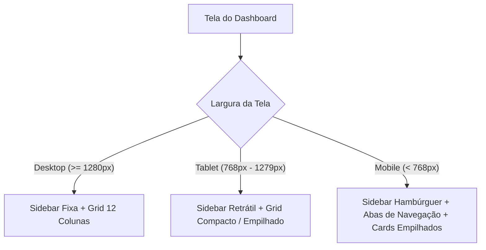

# Relatório de Revisão de Design e UX/UI: Dashboard Uniodonto Passos

Este documento apresenta a análise profunda do layout antigo (`index.old.html`) e estabelece as diretrizes de experiência do usuário (UX), interface de usuário (UI) e a estratégia de responsividade para a nova versão baseada em React.

---

## 1. Análise do Layout Antigo (`index.old.html`)

O layout original é rico em dados e possui uma proposta de tela única (*Single Screen Dashboard*) focada em KPIs de alta densidade. No entanto, sua implementação antiga em HTML estático e Tailwind CDN apresenta desafios de manutenção, legibilidade e adaptabilidade.

### Pontos Fortes Encontrados:
* **Densidade de Informação**: Excelente compilação de dados relevantes para tomada de decisão (Beneficiários, Leads, Conversão, ROI, Satisfação e Investimento).
* **Painel Escuro de Anúncios**: O uso de um painel escuro premium (`#0D040A`) para a seção de anúncios traz um excelente contraste e destaque visual, criando uma separação lógica entre o tráfego pago e os dados institucionais.
* **Componentes Interativos**: O funil de conversão visual com `clip-path` poligonal e as abas interativas fornecem dinamismo à interface.
* **Barra Lateral Retrátil**: Economiza espaço visual em telas menores, mantendo os links de navegação acessíveis.

### Pontos de Melhoria Identificados:
* **Sobrecarga de Informações no Mobile**: No layout original, a tentativa de manter tudo em tela única causa quebra de elementos e rolagem dupla infinita em dispositivos móveis.
* **Acessibilidade**: Algumas fontes muito pequenas (`text-[8px]`, `text-[10px]`) e contrastes no painel escuro podem dificultar a leitura para usuários com baixa visão.
* **Hierarquia Visual**: A tabela de investimentos lateral disputa muita atenção com o gráfico de anúncios. É necessário calibrar os pesos visuais.
* **Componentização**: A lógica de atualização via JavaScript puro é propensa a bugs de sincronização. A migração para React resolverá este problema de forma nativa.

---

## 2. Identidade Visual Uniodonto Passos

Preservamos a essência e a tradição da marca Uniodonto, refinando o aspecto visual para um design limpo, moderno e focado em credibilidade.

### Paleta de Cores Recomendada

| Nome | Hexadecimal | Uso no Sistema |
| :--- | :--- | :--- |
| **Vinho Uniodonto** (Principal) | `#D81B60` | Botões ativos, destaques primários, ícones importantes, bordas de foco. |
| **Rosa Secundário** | `#E91E63` | Gradientes em gráficos de barras, taxas de conversão secundárias. |
| **Vinho Profundo** (Sidebar) | `#880E4F` | Fundo gradiente da barra lateral, cabeçalhos escuros. |
| **Vinho Dark** (Painel Premium) | `#0D040A` | Fundo exclusivo do painel de desempenho de anúncios. |
| **Fundo Geral** | `#F8F9FA` | Cor de fundo das páginas para descanso visual. |
| **Cards e Superfícies** | `#FFFFFF` | Fundo de todos os cards de KPIs, tabelas e painéis internos. |
| **Sucesso (Verde)** | `#10B981` | Indicadores de crescimento positivo (`up` / vs. período anterior). |
| **Alerta/Perda (Vermelho)** | `#EF4444` | Indicadores de queda ou atenção (`down`). |

### Estilo e Elementos Visuais
* **Tipografia**: Utilização prioritária da fonte **Inter** (sans-serif) para legibilidade de números e dados.
* **Bordas**: Arredondamento suave e moderno nos cards (`rounded-2xl` / `1rem` ou `16px`).
* **Sombras**: Elevação leve e sutil (`shadow-sm` mudando para `shadow-md` no hover) para dar profundidade sem poluir a tela.
* **Espaçamento**: Adoção de um grid consistente com margens internas amplas (`p-6` / `24px` em desktop) para evitar sensação de aperto visual.

---

## 3. Estratégia de Responsividade Robustecida

A nova versão em React implementará uma estratégia de design adaptável com base em três perfis de dispositivos:



### 3.1. Desktop (Resoluções ≥ 1280px)
* **Estrutura**: Sidebar fixa à esquerda (com opção de colapsar para `76px`). Área de conteúdo dividida em um Grid de 12 colunas.
* **Distribuição**:
  * Carrossel horizontal de KPIs com setas elegantes de navegação quando em modo "Geral".
  * Gráfico de Anúncios (Coluna Esquerda, ocupando 7/12 do grid).
  * Funil e Abas (Coluna Esquerda, ocupando 5/12 do grid).
  * Tabela de Investimentos (Coluna Direita, ocupando 3/12 de ponta a ponta na vertical para equilíbrio visual).

### 3.2. Tablet (Resoluções entre 768px e 1279px)
* **Estrutura**: Sidebar colapsada por padrão para maximizar a área de trabalho.
* **Distribuição**:
  * Grid de KPIs reorganizado automaticamente para 2 colunas e 3 linhas (ou 3 colunas e 2 linhas dependendo do filtro de área).
  * Gráficos e Funil empilhados verticalmente em blocos separados.
  * Tabela de Investimentos se move para a parte inferior, ocupando largura total (100%) em formato horizontal de duas colunas, evitando compressão de dados.

### 3.3. Mobile (Resoluções < 768px)
* **Estrutura**: A sidebar física desaparece e é substituída por um **Menu Hambúrguer suspenso** no topo.
* **Filtros e Controles**:
  * O seletor de meses ganha um visual compacto, mostrando apenas o mês ativo com setas grandes fáceis de tocar.
  * Os filtros de "Área" (Geral, Marketing, Crescimento) passam a se comportar como uma barra de rolagem horizontal suave (*swipeable selector*).
* **Cards de KPIs**: Empilhamento vertical puro. O carrossel horizontal é desativado para evitar conflito com o gesto nativo do navegador. Fontes de valores crescem levemente e detalhes menores são omitidos para aumentar a legibilidade física.
* **Gráficos e Tabelas**:
  * O gráfico de anúncios escuro renderiza com rolagem lateral caso os dias da semana fiquem espremidos.
  * O Funil de Conversão substitui o visual de pirâmide por uma **Lista de Funil Horizontal Simplificada** ou barras horizontais tradicionais, pois o `clip-path` quebra em telas muito estreitas.
  * A tabela de investimentos ganha a opção de "Ver Mais" colapsável, exibindo as top 5 métricas por padrão para evitar rolagens desnecessárias na página.

---

## 4. Proposta de Hierarquia Visual e Componentização

A nova arquitetura React dividirá o Dashboard em componentes altamente modulares e reutilizáveis, garantindo isolamento de estado e facilidade de manutenção.

### Arquitetura de Componentes React

```
src/
├── components/
│   ├── layout/
│   │   ├── Sidebar.tsx             # Menu de navegação retrátil / hambúrguer
│   │   └── Header.tsx              # Título, seleção de área e controle mensal
│   ├── dashboard/
│   │   ├── KPICard.tsx             # Card de KPI reutilizável (com variantes de progresso e donut)
│   │   ├── KPICarousel.tsx         # Container com carrossel dinâmico dos cards
│   │   ├── AdPerformanceChart.tsx  # Componente escuro premium com Chart.js/Recharts
│   │   ├── ConversionFunnel.tsx    # Visual do funil de conversão com abas de Cidades/Origens
│   │   └── InvestmentTable.tsx     # Tabela de investimentos do mês com filtros
│   └── ui/
│       ├── Button.tsx              # Botão padrão Uniodonto
│       ├── ProgressBar.tsx         # Barra de progresso padronizada
│       └── DonutChart.tsx          # Minigráfico de rosca para beneficiários (PF vs PJ)
```

---

## 5. Checklist de Implementação UX/UI

Este checklist persistente rastreará o andamento dos ajustes de design e melhorias de usabilidade à medida que o projeto migrar para React.

> [!NOTE]
> Este checklist deve ser atualizado pelo desenvolvedor de UI a cada etapa concluída.

### Fase 1: Identidade Visual e Layout Base
- [ ] Aplicar a cor vinho Uniodonto `#D81B60` como cor primária global de botões e links ativos.
- [ ] Configurar fundo geral do aplicativo como `#F8F9FA`.
- [ ] Criar a Sidebar retrátil com gradiente `#D81B60` para `#880E4F` em desktop e menu hambúrguer para mobile.
- [ ] Definir sombras suaves nos cards (`box-shadow: 0 4px 6px -1px rgba(0,0,0,0.05)`) e efeito de elevação no hover.

### Fase 2: Componentização dos KPIs
- [ ] Implementar o `KPICard.tsx` genérico capaz de aceitar métricas de progresso, gráficos de rosca e tabelas internas.
- [ ] Programar o comportamento dinâmico de exibição dos cards baseado na "Área do Dashboard" selecionada (Geral, Marketing, Crescimento).
- [ ] Desenvolver o carrossel horizontal de KPIs com setas funcionais exclusivas para telas desktop.
- [ ] Desenvolver o minigráfico `DonutChart.tsx` em SVG nativo de alta fidelidade para o card de Beneficiários.

### Fase 3: Gráficos e Tabelas Responsivas
- [ ] Componentizar o gráfico de barras de anúncios usando o tema escuro premium `#0D040A` e mantendo a responsividade do Chart.js.
- [ ] Implementar as abas dinâmicas: Funil, Origem dos Leads e Cidades em React, adicionando animações suaves de transição.
- [ ] Refazer o Funil de Conversão adaptando para uma visualização em barras horizontais legíveis no ambiente Mobile.
- [ ] Criar a tabela de investimentos modular com filtros dinâmicos de categoria e tags de categoria codificadas por cores.

### Fase 4: Ajustes Finos e Acessibilidade
- [ ] Aumentar o tamanho de fontes menores de `8px`/`9px` para no mínimo `11px` no desktop e `12px` no mobile para garantir conformidade de acessibilidade.
- [ ] Adicionar estados de *Skeleton Loader* durante a transição de meses no seletor dinâmico para suavizar a experiência do usuário.
- [ ] Testar interações de toque (touch) em dispositivos móveis nos gráficos e abas do funil.
