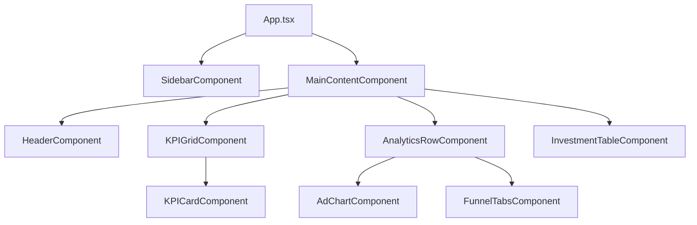

# Especificação Técnica do Produto - Dashboard Uniodonto Passos

Este documento apresenta as especificações completas de arquitetura, design, dados e funcionalidades para o **Dashboard Uniodonto Passos**. Ele serve como guia de implementação de referência absoluta para a migração do dashboard monolítico em HTML/JS puro para a estrutura moderna utilizando **React (v19) + Vite + TypeScript + Tailwind CSS (v4)**.

---

## 1. Objetivo do Projeto
Modernizar a interface do dashboard de gestão de beneficiários, vendas e marketing da Uniodonto Passos. O principal objetivo é garantir uma aplicação de página única (**Single Page Application**), altamente responsiva, com renderização otimizada de gráficos e atualização de dados de forma fluida ao alternar o período mensal e as áreas de foco.

---

## 2. Design System & Identidade Visual
O painel adota uma linguagem visual moderna, combinando elementos claros de alto contraste com um painel escuro de alta performance para a análise de tráfego de anúncios.

### Paleta de Cores
*   **Cor Primária (Brand Pink):** `#D81B60` (usada para botões principais, destaques, títulos de seções e segmentações ativas).
*   **Cor Secundária (Accent Pink):** `#E91E63` (degradês e realce secundário).
*   **Fundo do Painel Escuro (Premium Dark):** `#0D040A` (usado exclusivamente no container do gráfico de anúncios).
*   **Fundo da Sidebar:** Gradiente linear vertical indo de `#D81B60` a `#880E4F`.
*   **Fundo Principal do Dashboard:** `#F8F9FA` (tom claro suave para reduzir a fadiga visual).
*   **Bordas e Divisores:** `#F3F4F6` e `#E5E7EB`.

### Tipografia
*   **Fonte Principal:** `Inter` (sans-serif), importada do Google Fonts.
*   **Escala Tipográfica:**
    *   Títulos Principais: `text-3xl font-bold` (30px)
    *   Subtítulos/Títulos de Seção: `text-xl font-bold` (20px)
    *   Texto de Métricas (KPIs): `text-3xl font-bold` (30px) ou `text-2xl`
    *   Textos de apoio / Labels: `text-[10px]` ou `text-[11px]` (altamente compactados para caber em tela única sem rolagem excessiva).

---

## 3. Arquitetura e Estrutura de Componentes
O dashboard é estruturado de forma modular para promover a reutilização de código e simplificar a manutenção.

### Componentes Principais:
1.  **`App` (Componente Raiz):** Gerencia o estado global do período selecionado (`monthKey`), área de visualização (`area`), plataforma de anúncios (`adPlatform`), filtros de investimentos (`investmentFilter`) e estado da sidebar (recolhida/expandida).
2.  **`Sidebar`:** Componente de navegação lateral com capacidade de recolhimento (`collapsed`), persistindo seu estado no `localStorage` sob a chave `sidebar-collapsed`.
3.  **`Header`:** Contém o título dinâmico baseado na área de foco, as abas de alternância de área (Geral, Marketing, Análise & Crescimento) e o seletor de período dinâmico (Abril, Maio e Junho de 2026).
4.  **`KPIGrid / KPICard`:** Exibe os 6 cartões de métricas fundamentais. Se a área ativa for "Geral", atua como um carrossel horizontal contínuo. Se for "Marketing" ou "Análise & Crescimento", reorganiza-se em um grid estático de 4 colunas com cards específicos da área.
5.  **`AdChart`:** Renderiza o gráfico de barras vertical utilizando a biblioteca Chart.js (com o wrapper `react-chartjs-2`). Inclui filtros para as plataformas (Google Ads, Meta ADS e Instagram) e exibe as 6 métricas chave da plataforma selecionada no painel escuro.
6.  **`FunnelTabs`:** Card multifunção contendo três abas:
    *   *Funil de Conversão:* Representação visual geométrica em steps (`clip-path`) conectando Impressões, Cliques, Leads, Agendamentos e Vendas com taxas relativas de transição (CTR, Leads, Agendamento, Vendas).
    *   *Origem dos Leads:* Gráficos ou listagem complementar de conversões.
    *   *Cidades:* Tabela de municípios com número absoluto de beneficiários e crescimento.
7.  **`InvestmentTable`:** Listagem detalhada dos custos operacionais e de marketing do mês corrente, suportando filtragem por categoria (Todos, Marketing, Ads, Offline) e computação dinâmica do total filtrado.

---

## 4. Fluxo e Gerenciamento de Dados
O sistema armazena a base de dados estática do dashboard centralizada em um modelo de dados (`dashboardData`), estruturada por chaves temporais (`abril`, `maio`, `junho`). 

### Modelo de Dados por Mês
Cada período compreende:
*   `timestamp`: Horário da última atualização dos dados.
*   `beneficiarios`: Total de ativos, novos, cancelados, percentual vs. período anterior e detalhe de distribuição PF vs. PJ (utilizado no gráfico rosca minimalista do KPI 1).
*   `leads`: Total, percentual vs. anterior e distribuição de origem (Google, Meta, Indicação, Outros).
*   `conversoes`: Taxa de conversão, percentual em pontos percentuais (p.p.) vs. anterior, vendas fechadas, total de leads e meta mensal.
*   `investimento`: Total acumulado, percentual de variação, investido atual, orçado para o mês e percentual de progresso.
*   `roi`: ROI total, diferença, custo de aquisição (CAC), LTV estimado, proporção LTV/CAC e barra de progresso.
*   `nps`: Score de NPS, classificação, variação, total de respostas, distribuição de promotores/detratores e progresso.
*   `investimentosTabela`: Lista de itens contendo categoria (Marketing, Ads, Offline), métrica/canal e valor financeiro.
*   `anuncios`: Estatísticas segmentadas por Google Ads, Meta ADS e Instagram, incluindo a série semanal para o gráfico de barras (array de 7 inteiros), visualizações, campanhas, valor investido, leads, conversões e taxa de agendamento.
*   `funil`: Estatísticas de conversão e taxas relativas (CTR, Conversão de Leads, Agendamento e Vendas).
*   `cidades`: Tabela de municípios com volumetria de beneficiários e taxas de crescimento regional.

---

## 5. Layout Responsivo & Regras de Exibição
O layout é meticulosamente projetado para caber em uma **tela única de monitor profissional (1920x1080) sem rolagem vertical desnecessária**, enquanto se adapta fluidamente a telas de notebooks e dispositivos móveis.

*   **Telas de Desktop / Monitores (xl e superiores):** Layout de 12 colunas dividido entre:
    *   Coluna Principal Esquerda (9 colunas): Contém os KPIs superiores e a linha com o Gráfico de Anúncios e Funil de Conversão.
    *   Coluna Direita (3 colunas): Ocupa toda a altura vertical com a Tabela de Investimentos e informações de timestamp de atualização.
*   **Telas Médias (MD/LG):** Grid fluido com empilhamento das seções em blocos de fácil leitura. O carrossel de KPIs recolhe para 2 ou 3 colunas visualizáveis simultaneamente.
*   **Dispositivos Móveis (SM):** Elementos empilham-se verticalmente. O menu de navegação da Sidebar recolhe por padrão. O carrossel de KPIs permite navegação horizontal por toque (swipe) ou cliques nas setas.

---

## 6. Próximos Passos na Implantação
1.  **Refatoração dos Componentes:** Separar a lógica do monolito `index.old.html` em componentes React funcionais na pasta `src/components`.
2.  **Configuração do Tailwind CSS v4:** Garantir a aplicação das cores customizadas da Uniodonto (`brand-primary`, `brand-secondary`, `brand-dark`, `brand-bg`) no arquivo de configuração do Tailwind.
3.  **Implementação de Gráficos:** Configurar o Chart.js na estrutura do React com customização de degradês e tooltips em dark premium.
4.  **Validação de State:** Centralizar a mudança de meses e filtros nos hooks do React (`useState`), assegurando que a transição de valores ocorra com animações fluidas (`transition-all duration-300`).
5.  **Testes de QA:** Validar a aderência aos limites do design system e consistência matemática dos dados apresentados.
